## git set up

[Git for Windows](https://gitforwindows.org/)  

### steps
- Gitのインストーラーに従ってインストールします。

    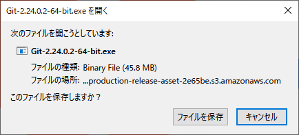

    

    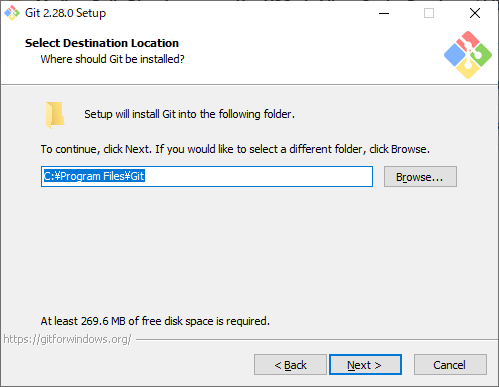

    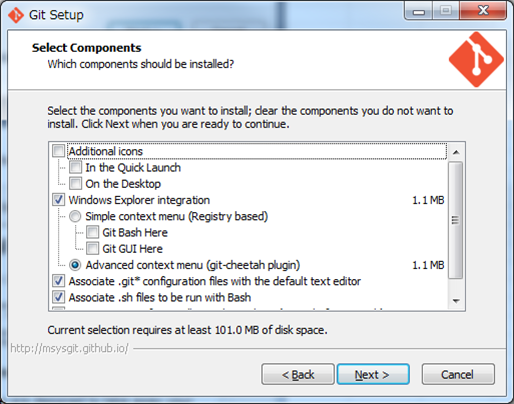

    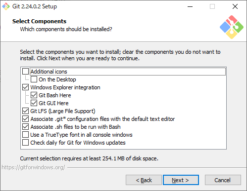

    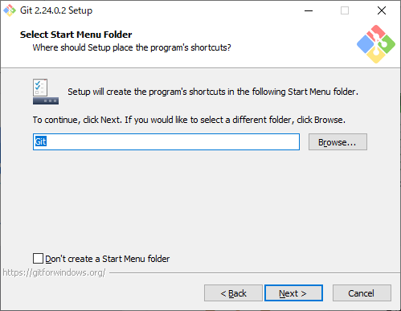

    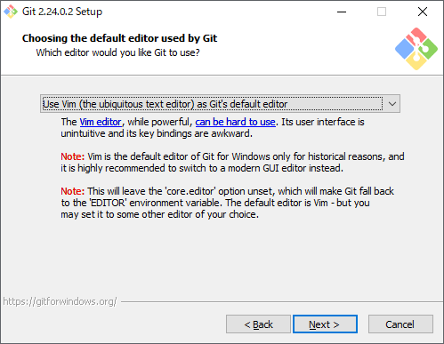

    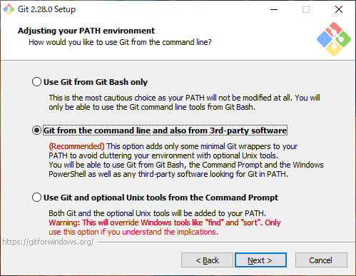

    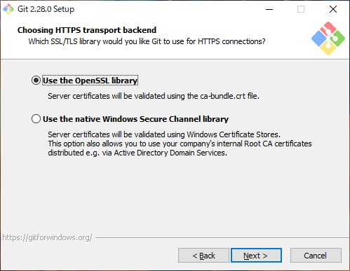

    

    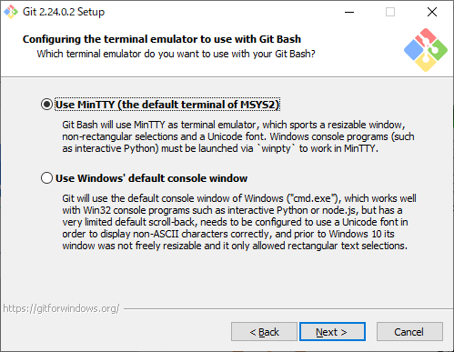

    

    

    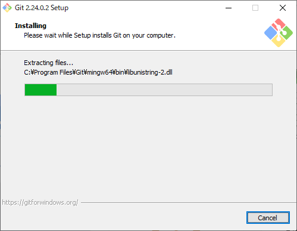

    

    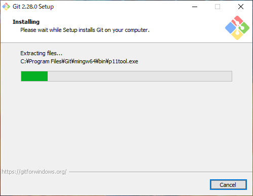

- Git BashでGitHubにSSH接続
  - 参考：[[Windows 10] Git BashでGitHubにSSH接続](https://qiita.com/coffee_g9/items/e1b9ab28cfa54f854308)
  - 参考：[【Git】Windows環境でGitHubにSSH接続してコミットするまでの手順](https://qiita.com/hollyhock0518/items/a3fee20951cd92c87ed9)
