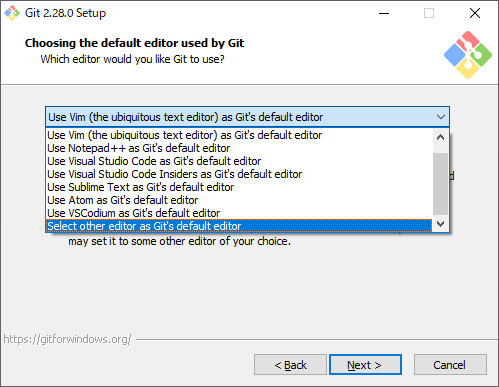

## git set up

[Git for Windows](https://gitforwindows.org/)  

### steps
- Gitのインストーラーに従ってインストールします。
    

    

    

    

    

    

    

    

    

    

    

    

    

    

    

    

