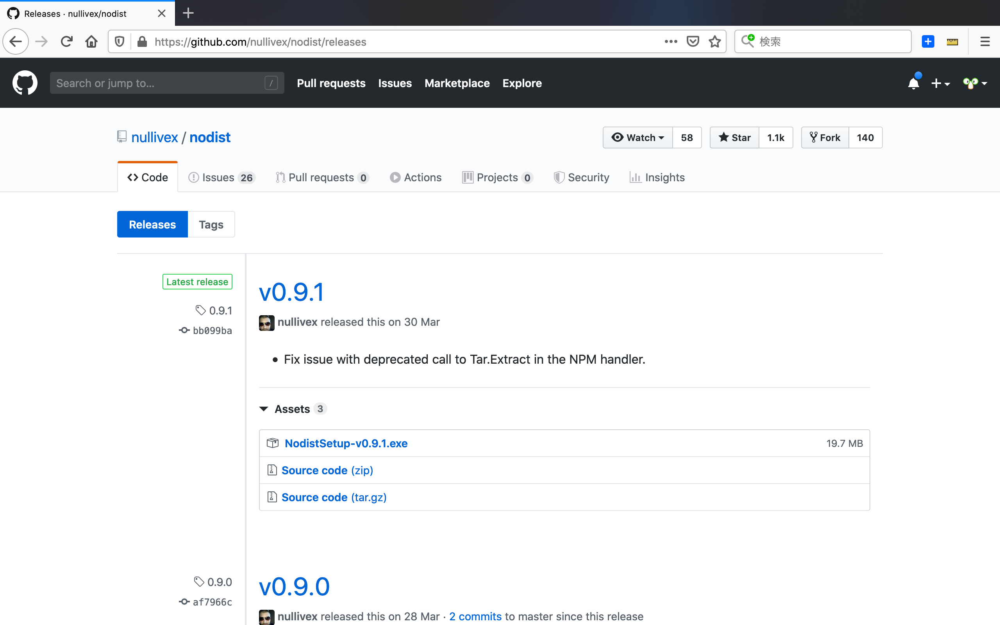
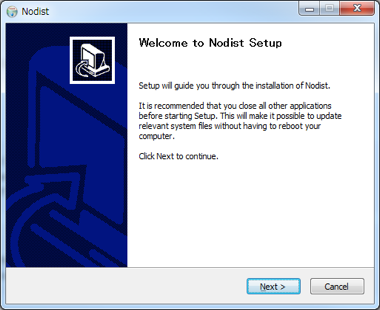
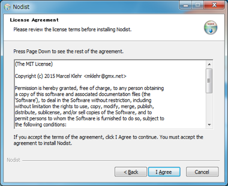
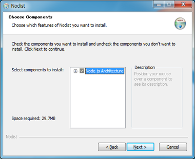
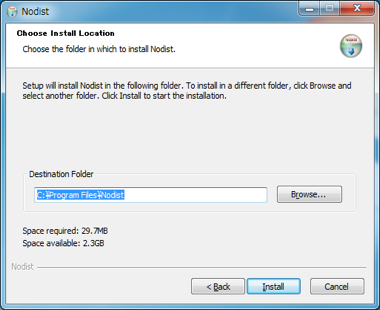
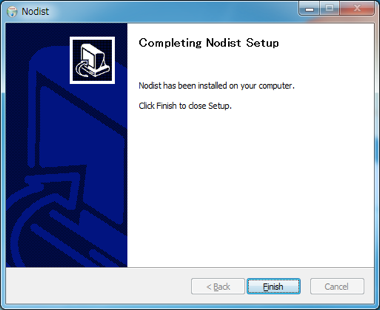
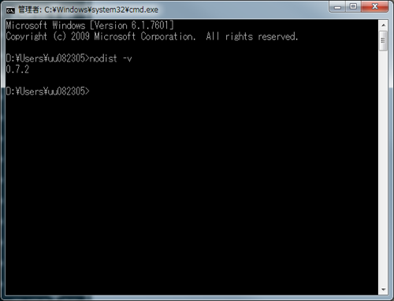

## nodist set up


### steps
- [nodist](https://github.com/marcelklehr/nodist)のページを開きます。
- 本サイト内にあるWindows用インストーラーの[リンク](https://github.com/nullivex/nodist/releases)をクリックし、ダウンロードします。
    

- インストール前のnodist，nodeの状態
    ```
    $ nodist -v
    $ node -v
    ```
- インストーラーで、Nodistをインストールします。
    
- ライセンスに同意する
    
- デフォルトのまま　特に指定なし
    
- デフォルトのまま　特に指定なし
    
- インストール開始
    
- インストール完了
    
- nodist -vでバージョンが表示されれば、OKです。
    ```
    $ nodist -v
    ```
    


