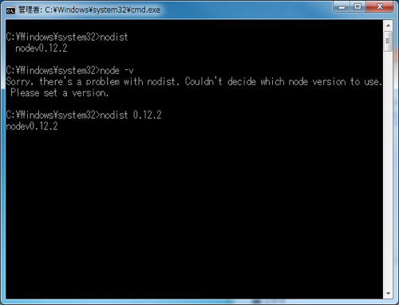

## nodist set up


### steps
- [nodist](https://github.com/marcelklehr/nodist)のページを開きます。
- 本サイト内にあるWindows用インストーラーの[リンク](https://github.com/nullivex/nodist/releases)をクリックし、ダウンロードします。
    

- インストール前のnodist，nodeの状態
    ```
    $ nodist -v
    $ node -v
    ```
    
- インストーラーで、Nodistをインストールします。  
    
- ライセンスに同意する  
    
- デフォルトのまま　特に指定なし  
    
- デフォルトのまま　特に指定なし  
    
- インストール開始  
    
- インストール完了  
    
- nodist -vでバージョンが表示されれば、OKです。
    ```
    $ nodist -v
    ```
    
- node は、まだ環境構築されていない
    ```
    $ node -v
    ```
    
- nodist + v0.12.2を行い、v0.12.2をダウンロードします。
    ```
    $ nodist + v0.12.2
    ```
    
- 上記手順後でもnode は、まだバージョン表示されない
    ```
    $ node -v
    ```
    
- nodist 0.12.2でバージョン指定を行います。
    ```
    $ nodist 0.12.2
    ```
    
- node -vでバージョンが表示されれば、OKです。
    ```
    $ node -v
    ```
    
