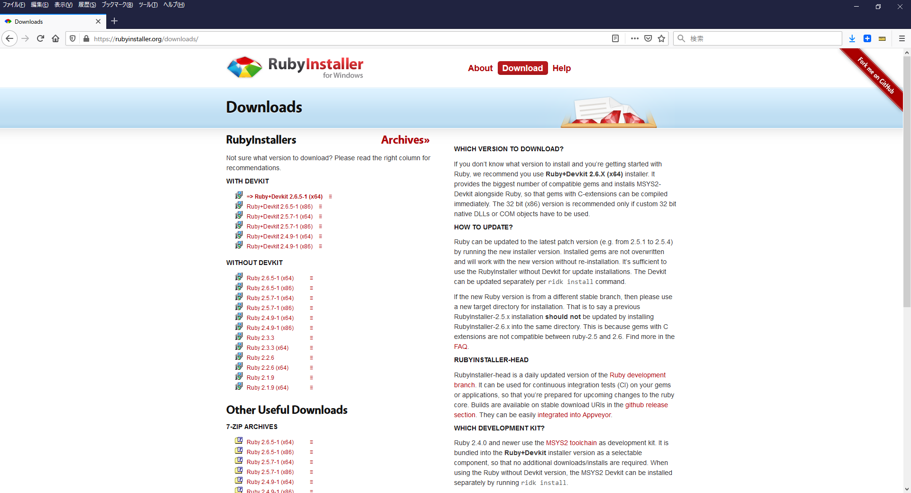
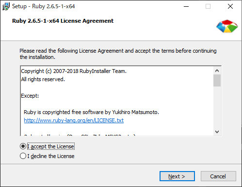

## ruby set up

[Download Archives](https://rubyinstaller.org/downloads/archives/)

### steps
- [v2.6.5](https://github.com/oneclick/rubyinstaller2/releases/download/RubyInstaller-2.6.5-1/rubyinstaller-2.6.5-1-x64.exe) をダウンロードします。
- インストーラに従って、インストールします。　C:\Ruby26
    
